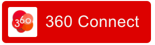

# OAuth 360 Connect JS SDK

<div style="text-align:center">

</div>

## Getting started on the web

Import the SDK js bundle into your HTML page (see also example in `web-login-demo.html`).

```html
<!doctype html>
<html lang="en">
<head>
    <meta charset="utf-8">
    <title>360Connect JS SDK</title>
    <!-- jquery helpers to to that demo quicker -->
    <script src="https://cdnjs.cloudflare.com/ajax/libs/jquery/3.2.1/jquery.slim.min.js"></script>
    <script src="../dist/360connect-js-sdk.bundle.js"></script>`
</head>
<body>
    ...
</body>
</html>
```

### Configuration

Configure the SDK with your API keys and client credentials. Choose `ENV=staging` for the sandbox (`beta.360medical.fr`).

See also (notes about security in single page applications)[#security].

```javascript
const ENV = 'staging';
const CLIENT_ID = '<MY_CLIENT_ID>';
const CLIENT_SECRET = '<MY_CLIENT_SECRET>';
const REDIRECT_URI = 'http://beta.360medical.fr/oauth/v2/auth_login_success'; // to enable the web popup
const SCOPE = 'anon_scope'; // choose a scope 'anon_scope|reduced_scope|full_scope'

// initialize the SDK
Connect.OAuth()
    .initialize({ clientId: CLIENT_ID, clientSecret: CLIENT_SECRET, environment: ENV });

```

### Showing the login button

<div style="display:flex">
Show the login button (featuring user status) somewhere in your HTML .
</div>

```html
<login-button></login-button>
```

### Checking logged in status

This is what you should do first to check if the user is already logged in to 360medical.

```javascript
// first check user logged in status
// pass true to force a request otherwise the SDK loads status from the cache
Connect.OAuth().getLoginStatus(true).then(response => {

    // response {}

    if (response.status === "connected") {
        let user = Connect.OAuth().getUser(); // { user: { <data depends on the scope...> } }    
    } else {
        // not connected, we might want to show to login button here
    }
});
```
